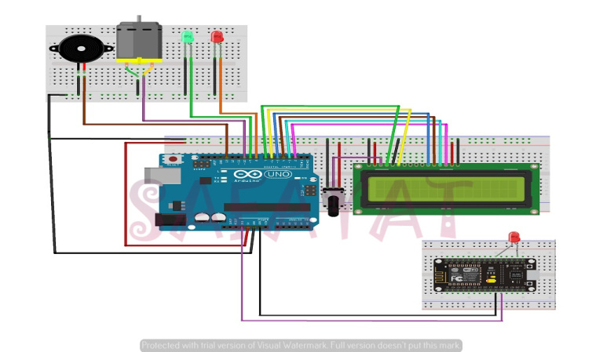

# smart kitchen
# Introduction :
Leakage of LPG can be dangerous as it raises the risk of building fire,suffocation or an explosion.For every 20L volume of air ,2% to 10% of LPG in air is enough to cause an explosion.In such a case, a gas leakage detector becomes vital and helps to protect people from the dangerous of gas leakage.
# Objectives : 
The primary objective of this project are to :
*Detect gas leakage from gas cylinders and gas service line.
*Automated alarm system to notify the dwellers about the leakage of LPG.
*Automated exhausting of air in order to reduce the quantity of LPG from the kitchen.
*Control the electrical components (light,fan etc. ) of the kitchen over a web server.
# Apparatus : 
* Arduino Uno
* LCD Display 16*2
* ESP8266 wifi module
* MQ-6 LPG gas sensor
* Buzzer
* Fan
* LED
* Bread board and
* Jumper wires
# Schematics : 

# Code : 
[Code for Arduino](Smart_Kitchen_Arduino.ino)
[Code for ESP](Smart_Kitchen_ESP.ino)
# How it works : 
When gas leakage of a detectable quantity capable of causing explosion which is sensed by the MQ-6 sensor, an analogue signal is send to the arduino from the sensor. For a detectable gas leakage quantity a digital high (1) is transmitted while a digital low(0) is transmitted for a non detectable quantity. This quantized high signal turns on a buzzer to alert neighbour of possible danger so they can react to diffuse the situation. The signal also turns on an LED to show danger.An automatically exhaust fan also turns on to exhaust the harmful gas from the kitchen.
Besides ,  we can also control the electrical components of the kitchen such as light,fan,etc. over a web server  .

